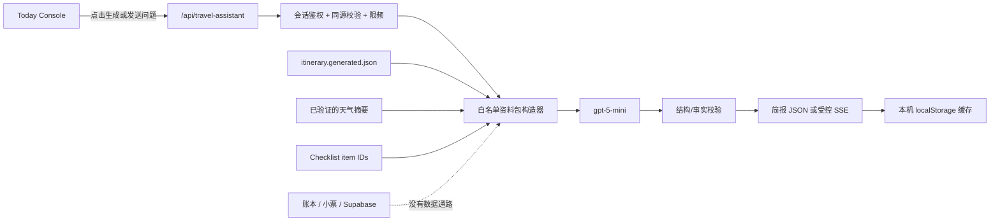

# Today Console AI 旅行助理设计

日期：2026-07-15  
状态：已选择方案 A，待设计复核  
范围：Aussie Chill 的“今日旅行控制台”

## 1. 目标与非目标

在现有 Today Console 内增加一个按需使用的 AI 调度卡，提供：

1. “生成今日简报”按钮；
2. 结构化今日简报；
3. 简报下方的追问对话；
4. 默认回答当天问题，并能在问题明确指向其他日期、城市、景点或全程时扩展资料范围。

明确非目标：

- 页面载入时不自动调用模型；
- AI 不修改行程、订单、票据、Checklist、账本或 Supabase；
- AI 不读取整个网页，也不接触账本金额、付款人、小票、操作历史或 Supabase 私人数据；
- 不新增悬浮聊天机器人；
- 不把硬时间、实时天气或票券状态交给模型重新生成。

## 2. 已确认的接口能力

第三方接口使用 OpenAI-compatible 协议：

- API base：`https://www.openai-labs.com`
- 路径：`POST /v1/chat/completions`
- 模型：`gpt-5-mini`
- JSON object 输出：已验证；响应的 `message.content` 是 JSON 字符串，服务端必须再次解析并校验；
- 流式输出：已验证；返回标准 SSE `data:` 事件并以 `[DONE]` 结束。

密钥只使用服务端环境变量 `TRAVEL_AI_API_KEY`，代码库只出现变量名，不能出现变量值。其余配置使用：

- `TRAVEL_AI_BASE_URL`
- `TRAVEL_AI_MODEL`

这些变量均不得使用 `NEXT_PUBLIC_` 前缀。

## 3. 方案选择

采用方案 A：一个受保护的服务端入口，按 `mode` 分流。

```text
POST /api/travel-assistant
```

支持两种模式：

- `brief`：返回经过结构校验的 JSON 简报；
- `chat`：返回受控的 SSE 对话响应。

没有采用的方案：

- 分拆成 brief/chat 两个接口：会重复鉴权、限频、资料包和错误处理；
- 由浏览器拼完整 prompt：无法保证资料白名单，也会扩大泄露面；
- 引入通用 AI SDK 或持久化聊天框架：首版需求不需要，增加依赖和状态复杂度。

## 4. 组件与数据流



浏览器请求只允许包含：

- `mode`
- `dayId`
- 经过长度限制的天气摘要字段
- 当前设备已勾选的 Checklist item IDs
- 对话模式下的问题与有限历史

浏览器不提交完整 day object，也不提交自由格式的“上下文”。服务端根据 `dayId` 从受保护的 `itinerary.generated.json` 重建事实，避免客户端把额外内容夹带给模型。

Today Console 现有账本 props 继续服务于账本卡，但不会传给新的 `TravelAssistantPanel`，请求构造函数也不接收账本或票据图片参数。

## 5. 受控行程资料包

### 5.1 当天完整资料

允许字段：

- day id、标签、日期、星期、城市、标题和 focus；
- 交通、最晚出门、住宿；
- 每个行程 block 的 period、place、activity、highlight、tip；
- 住宿、主项目、票券和 block resource 的 id、标题与类型；
- 早餐、午餐、晚餐文字；
- 天气 status、summary、adviceLabel、detail；
- 服务端按当天规则生成的 Checklist 项目，以及客户端提交的勾选状态。

资源 URL、图片、费用以及任何账本派生状态不进入模型资料包。模型不需要链接即可判断节奏，链接仍由网站直接展示。

### 5.2 全程精简索引

D0-D16 每天只包含：

- day id、日期、城市；
- 标题与一句 focus；
- 交通类型；
- 主要停靠点名称。

全程索引用于定位相关日期，不代替当天完整资料。

### 5.3 跨日期路由

服务端使用确定性匹配，不让模型自行决定要读取哪些天：

- 普通问题：只加入当前 day 的完整资料；
- 提到 `D0` 至 `D16`、具体日期、城市或资料包中已有景点：加入匹配 day 的完整资料；
- 提到“全程、整趟、整个行程、所有天、哪一天”等全程意图：加入当前 day 完整资料和 D0-D16 精简索引；
- 单次最多加入当前日之外 3 天的完整资料，避免上下文无限扩大；
- 匹配不到时仍按当天回答，并明确“当前行程资料中没有找到该地点/日期”。

## 6. 结构化今日简报

简报只生成建议，不复述硬时间、天气和票券：

```json
{
  "pace": {
    "level": "easy | balanced | full",
    "note": "一句节奏建议"
  },
  "priorities": [
    { "factId": "block:d14:10", "reason": "为什么优先" }
  ],
  "tradeoffs": ["风险或取舍"],
  "firstCut": {
    "factId": "block:d14:40",
    "reason": "为什么先删"
  },
  "tomorrowPrepItemIds": ["weather-shell"],
  "suggestedQuestions": ["推荐追问"]
}
```

约束：

- priorities 必须正好 3 项；
- `factId` 和 `tomorrowPrepItemIds` 必须来自服务端资料包；
- 地点、项目标题和 Checklist 文案由服务端按 ID 回填，模型不能创造；
- prose 字段限制长度，并禁止出现资料包中不存在的精确时间或日期；
- 结构、枚举、数组长度、ID、时间和日期任一校验失败时，不展示原始模型输出，返回可重试错误；
- 金额、付款、分摊、小票类内容一律视为无效输出。

这样硬事实仍由网站掌控，模型只负责“怎么取舍”的理由。

## 7. 追问对话

对话区位于简报下方，生成简报后才显示，默认折叠。

快捷问题：

- 下雨怎么调整？
- 今天太累可以删什么？
- 午餐放在哪里最顺？
- 明天要提前准备什么？

规则：

- 历史只保留当前设备最近 8 轮；
- 单条问题限制 400 字；
- 模型只能给建议，不能产生写操作；
- 回答中若涉及硬时间、天气或票券，必须提示以 Today Console 的确定信息为准；
- 回答同时返回服务器确认过的 `sourceDayIds`，界面显示“参考 D14 / D15”等资料范围；
- 服务端先完整收集并执行事实校验，再把通过的文本以 SSE 分段发给浏览器；未经校验的 token 不直接进入页面。

## 8. 缓存与资料更新

简报和对话只存当前浏览器 localStorage，不进入 Supabase：

- 简报 key：按版本和 dayId 分开；
- 对话 key：按版本和 dayId 分开；
- 保存生成时间、资料 fingerprint、简报内容和资料范围；
- fingerprint 只由允许发送的当天行程字段、天气摘要和 Checklist IDs 计算；
- 刷新时 fingerprint 相同则直接读取缓存，不调用模型；
- fingerprint 不同则保留旧简报但标记“资料已更新，可重新生成”；
- 只有用户点击“重新生成”才再次调用模型；
- “清空对话”只删除本机对话，不删除简报或其他网站数据；
- localStorage 不可用时，本次会话仍可使用，但刷新后不保留。

## 9. 接口安全、超时和失败回退

接口复用现有保护边界：

- 必须通过现有旅行访问会话鉴权；
- POST 必须通过同源 mutation 校验；
- 响应使用 private/no-store headers；
- 严格校验 mode、dayId、body 大小、天气字段、Checklist IDs、问题和历史；
- 上游请求使用 AbortController 超时；brief 默认 20 秒，chat 默认 30 秒；
- 服务端基础限频：同一会话/IP 指纹短时间防连点，并限制 10 分钟窗口内的调用次数；
- 浏览器按钮同时有冷却与 in-flight 去重；
- serverless 内存限频属于基础保护，不引入 Supabase 或新的持久化服务；
- 上游超时、非 2xx、结构错误或事实校验失败时返回统一错误码和用户可读提示，不返回上游原文、prompt、密钥或堆栈。

任何 AI 失败都只影响 AI 卡；原行程、天气、Checklist、票据、账本和离线恢复继续可用。

## 10. 界面方案 A

AI 卡插入位置：

```text
Today Console 标题
→ 今日交通 / 最晚出门 / 住宿 / 天气 / 穿衣
→ 餐食
→ 票夹
→ AI 今日简报调度卡
→ Checklist / 账本
→ 今日详细节奏 / 快捷入口
```

视觉原则：

- 延续旅行票夹 / 路书语言，使用现有米白、深青和陶土色；
- AI 是“建议层”，不使用高饱和渐变或悬浮机器人造型；
- 未生成时只显示一句说明和主按钮；
- 生成后分区显示节奏、3 项优先级、风险取舍、最先可删、明日准备和推荐追问；
- 生成时间、资料范围和更新状态放在卡片顶部的小状态行；
- 对话默认折叠，显示消息数；手机展开后使用内部滚动，避免挤走天气、票据和 Checklist；
- 快捷问题在手机端横向滚动；输入区保持紧凑；
- loading 使用卡内 skeleton，不改变 Console 其他区域高度；
- error 显示“AI 暂不可用，原行程仍可正常查看”和重试按钮。

需要覆盖的状态：尚未生成、生成中、已生成、资料更新、失败可重试、对话折叠/展开、离线不可生成。

## 11. 分阶段发布

### V1：今日简报

- 配置服务端环境变量；
- 建立白名单资料包、brief 接口、安全校验、限频和超时；
- 上线按钮、结构化简报、缓存、更新提示、失败回退；
- 预览验证后部署生产。

### V1.1：当天追问

- 加入折叠对话、快捷问题、当前日上下文、流式传输、本机历史和清空；
- 预览验证后部署生产。

### V1.2：跨日期与全程查询

- 加入 D0-D16 精简索引和确定性日期/城市/景点路由；
- 显示回答资料范围；
- 预览验证后部署生产。

每个版本独立验证并保留可回滚的生产部署，不在中间版本修改账本、票据、行程源数据或 Supabase。

## 12. 验证证据

自动化测试至少证明：

- 资料包字段白名单正确，账本金额、付款人、小票、操作历史和 Supabase 字段无法进入请求；
- brief 输出结构、ID、时间、日期和敏感词校验；
- 默认只选择当天资料；D13、日期、城市、景点和全程意图映射正确；
- 同一 fingerprint 刷新读取缓存，不再次请求；资料变化出现更新提示；
- 限频、超时、上游失败和非法响应均安全回退；
- 未鉴权、跨站 POST、过大输入和非法 dayId 被拒绝；
- 客户端 bundle 和 API 响应中不存在 API Key。

浏览器验证至少覆盖：

- 桌面和 390px 手机：无横向溢出，AI 对话不会挤压其他 Console 区域；
- 生成、刷新缓存、重新生成、折叠、清空和离线状态；
- 默认当天追问、跨日期问题和全程问题；
- AI 接口失败时行程仍可展开、天气仍显示、Checklist 仍可勾选；
- 真实账本同步、离线恢复、票据查看和记账入口没有回归。

发布闸门：先在 Vercel preview 使用真实接口完成上述验证，确认网络请求不含禁发资料、客户端不含密钥，再部署 production 并做一次生产烟测。
